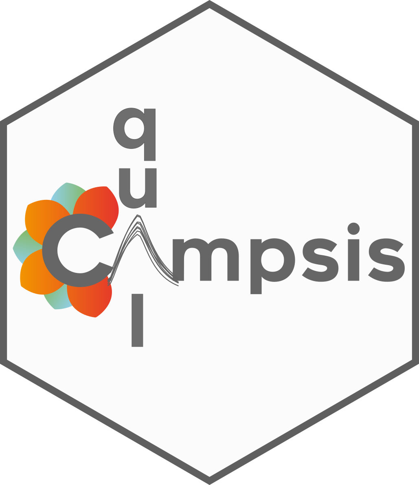

# campsisqual 

<!-- badges: start -->
[](https://github.com/Calvagone/campsisqual/actions)
<!-- badges: end -->


A library dedicate to the qualification of the Campsis Suite and to the qualification of Campsis models against NONMEM, provided you have the `campsistrans` package.

## Installation

Install the latest release from GitHub:
  
```{r, eval=FALSE}
remotes::install_github("Calvagone/campsisqual")
```

Install TinyTEX:
  
```{r, eval=FALSE}
tinytex::install_tinytex()
```

## Qualify the Campsis Suite

Please contact Calvagone to get your certificate and the qualification suite.

```{r, eval=FALSE}
library(campsisqual)
credentials <- Credentials(cert = "<PATH_TO_CERTIFICATE>",
                           key = "<PATH_TO_PRIVATE_KEY>",
                           passphrase = "<PASSPHRASE>")

suite <- QualificationSuite(path = "<PATH_TO_QUALIFICATION_SUITE>",
                            credentials = credentials)

runQualification(
  packages = c(
    "campsismod",
    "campsis",
    "campsisnca",
    "campsismisc",
    "campsisqual"
  ),
  fullname = "<YOUR_NAME>",
  qualification_suite = suite
)
```
